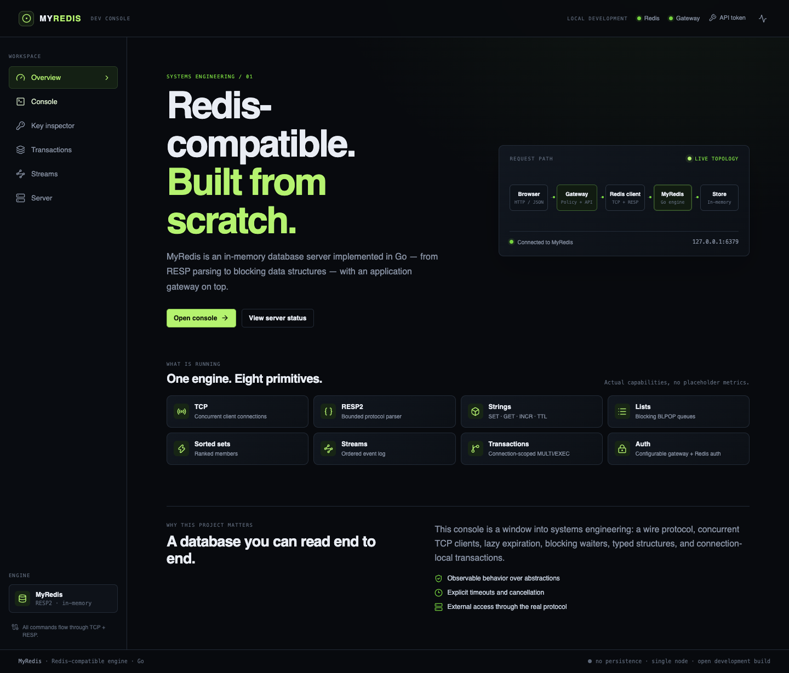
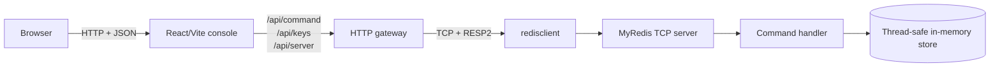
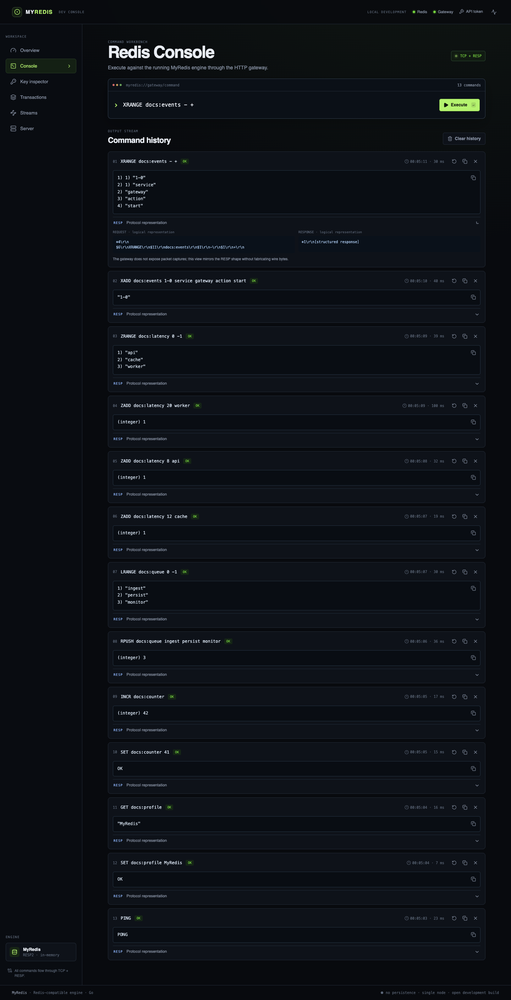
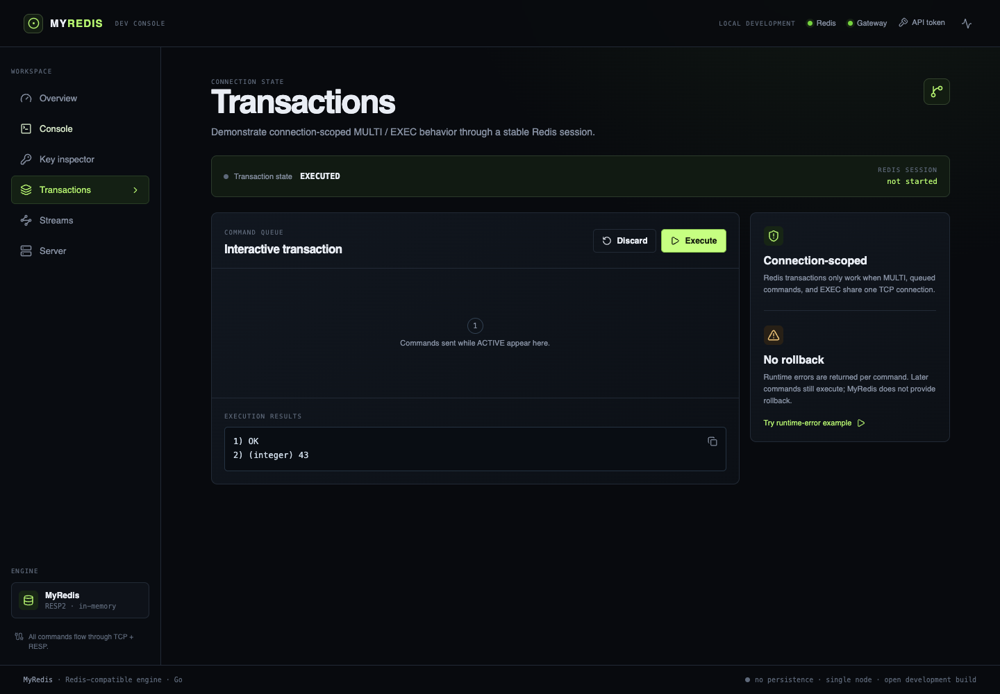
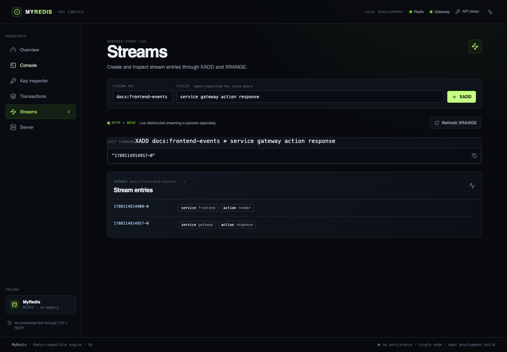
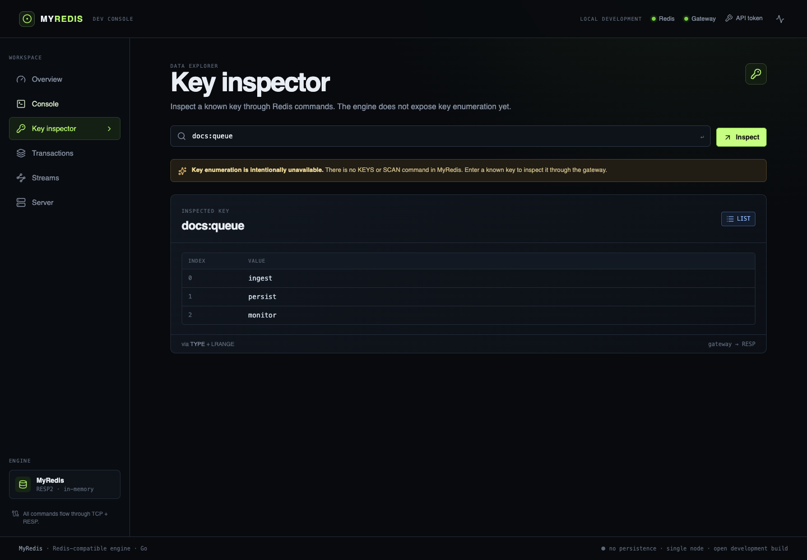
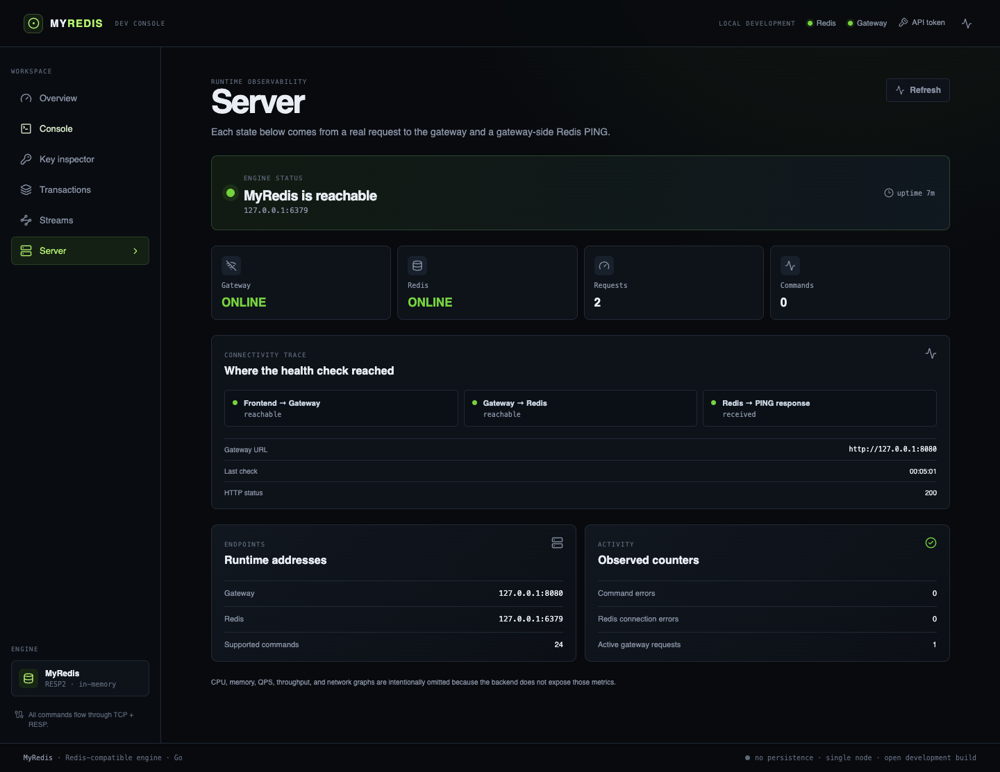

# MyRedis

MyRedis is a Redis-compatible, in-memory database server built from scratch in
Go. It implements a deliberately scoped RESP2 command set, concurrent TCP
clients, blocking list and stream operations, connection-local transactions,
authentication, and a small HTTP gateway. A React + TypeScript console makes
the complete request path observable in a browser.

This is a systems-engineering and development project, not a drop-in
replacement for production Redis: it is single-node, in-memory, and has no
persistence, replication, clustering, or complete Redis ACL rule system.

## See it running

The screenshots and recording below were captured from the real stack running
locally: MyRedis, the HTTP gateway, and the Vite frontend.

[▶ Watch the real frontend walkthrough](docs/assets/myredis-walkthrough.webm)

The recording walks through connectivity, commands, typed responses, a
transaction, stream entries, key inspection, and the server health trace.



*The Overview page shows the live request topology and the capabilities exposed
by the running engine.*

## What is included

- A concurrent Go TCP server that speaks a bounded RESP2 subset.
- A thread-safe in-memory store for strings, lists, sorted sets, and streams.
- Optional key expiration with `SET ... EX` and `SET ... PX`.
- Blocking `BLPOP` and `XREAD BLOCK` with timeout, shutdown, and disconnect
  cancellation.
- Connection-local `MULTI`, `EXEC`, and `DISCARD` transactions.
- Built-in `default` user authentication and the implemented ACL inspection /
  password operations.
- An HTTP gateway that converts command requests and typed RESP replies to JSON,
  centralizes command policy, keeps transaction sessions, and reports health
  counters.
- A browser console with command history, RESP shape inspection, known-key
  inspection, transaction and stream workbenches, and connectivity diagnostics.

## Architecture



The browser never opens a Redis TCP connection and never receives the Redis
username or password. The gateway is an application boundary: it talks to
MyRedis through the same TCP/RESP protocol as any other client and does not
import or manipulate store internals.

### Backend request lifecycle

1. `app/main.go` creates a server, optionally configures the default-user
   password, and starts the TCP listener.
2. `app/server` accepts connections and starts one goroutine per client. Each
   connection has idle read and bounded write deadlines and is tracked for
   graceful shutdown.
3. `app/resp` parses one RESP2 array of bulk strings at a time. Input limits are
   checked before large allocations; malformed, truncated, oversized, and
   incorrectly terminated frames are rejected.
4. `app/handler` validates command arguments, enforces authentication and
   transaction state, dispatches the command, and writes a typed RESP2 reply.
5. `app/store` owns the data structures and synchronization. Normal handler
   dispatches use a command mutex; individual store methods also protect their
   maps with an `RWMutex`.
6. The gateway's `app/redisclient` decodes the reply without flattening it.
   The HTTP response preserves simple strings, errors, integers, bulk strings,
   nulls, nested arrays, and mixed `EXEC` replies as JSON types.
7. The frontend renders the typed response and records the command, duration,
   and optional logical RESP representation in local history.

## Backend behavior in detail

### TCP server and concurrency

`server.Server` owns the listener, active connection set, cancellation context,
and wait group. Every accepted connection is served independently, so multiple
clients can issue commands concurrently. `Shutdown` stops accepting new
connections, cancels blocked operations, closes active connections, and waits
for connection goroutines to exit.

For a potentially blocking command, the server attaches a disconnect monitor to
the connection. Bytes read while monitoring are retained for the command parser;
an EOF, shutdown, or cancellation wakes the blocked operation and cleans up its
waiter registration.

### RESP2 protocol

Commands are accepted as RESP2 arrays of bulk strings. Replies use the RESP2
types implemented in `app/resp`:

| RESP type | Example | Used for |
| --- | --- | --- |
| Simple string | `+OK\r\n` | status replies such as `SET`, `MULTI` |
| Error | `-ERR ...\r\n` | syntax, type, and runtime errors |
| Integer | `:42\r\n` | counters, lengths, ranks |
| Bulk string | `$5\r\nhello\r\n` | values, IDs, members |
| Null bulk/array | `$-1\r\n` / `*-1\r\n` | missing values and timeouts |
| Array | `*N\r\n...` | ranges, streams, and `EXEC` |

The parser defaults to a maximum of 1,024 command elements, 16 MiB bulk
strings, and 64 KiB protocol lines. The client decoder independently limits
reply bulk strings, array elements, and nesting depth.

### Store and data structures

The store keeps separate maps for each supported Redis type and enforces one
type per key. A command against an incompatible type returns Redis-style
`WRONGTYPE`; `SET` replaces an existing value.

- **Strings** use a value plus optional expiry metadata. `GET`, `SET`, `INCR`,
  and `TYPE` are implemented.
- **Lists** use slices with push/pop operations from either end. `LRANGE`
  supports inclusive ranges and negative indexes; `LLEN` reports length.
- **Sorted sets** use a member-to-score map for lookup and a score/member-sorted
  slice for rank and range operations. Ties are ordered by member name.
- **Streams** use ordered `milliseconds-sequence` IDs and preserve field order
  in each entry. `XADD`, `XRANGE`, and `XREAD` are implemented.

The store's `RWMutex` protects individual structures. The handler's command
mutex serializes normal command dispatch and an entire `EXEC` batch so a batch
cannot be interleaved with another handler-dispatched command. Blocking calls
do not hold that command mutex while they wait, allowing another client to
produce the value that wakes them.

### Expiration and TTL

`SET key value EX seconds` stores a seconds-based expiry and `PX milliseconds`
stores a millisecond-based expiry. Expired strings are treated as absent when a
key is inspected; the store removes them when a write-locked type check runs.
There is currently no `TTL` command or TTL field in the gateway key-inspection
response.

### Blocking operations

`BLPOP key [key ...] timeout` first checks keys in the requested order. If no
list has an item, a FIFO waiter is registered for each key and the call waits
until a producer pushes an item, the timeout expires, the client disconnects,
or the server shuts down. Concurrent delivery is restored to the list if a
waiter loses a cancellation/timeout race.

`XREAD BLOCK milliseconds STREAMS key [key ...] id [id ...]` waits for an entry
strictly newer than each supplied ID. `$` means “the current last ID” at the
time the wait begins. When any stream advances, the response is re-read so
entries available on all requested streams are returned together.

Blocking commands are bounded by the gateway request timeout for HTTP callers.
They cannot run inside `EXEC`; the transaction returns a runtime error for that
queued command and continues with later commands.

### Transactions

`MULTI` starts a connection-local queue. Commands received afterward return
`QUEUED` and are copied into that connection's transaction state. `EXEC` runs
the queued commands sequentially and returns an array containing each reply;
runtime errors are values in that array, not a rollback trigger. `DISCARD`
clears the queue. Nested `MULTI` and `EXEC`/`DISCARD` outside a transaction are
rejected.

The gateway requires an `X-Redis-Session` header for all transaction commands
and reuses one TCP client for that session. Sessions live in memory and are
intended for development use.

### Authentication and ACL

The server has a built-in `default` user. It starts passwordless unless
`-requirepass` is supplied. TCP clients can use `AUTH username password` and the
implemented `ACL WHOAMI`, `ACL GETUSER`, and `ACL SETUSER` operations. Passwords
are stored as SHA-256 hashes in the user registry.

The public gateway deliberately denies `AUTH` and `ACL`; it authenticates to
Redis internally using `REDIS_USERNAME` and `REDIS_PASSWORD`. Browser/API
authentication is a separate optional gateway bearer token (`API_TOKEN`) or
`X-API-Key`. Redis credentials remain gateway-side configuration.

## Frontend console

The frontend in `frontend/` is a standalone React + TypeScript + Vite app. It
uses only the HTTP gateway and stores command history and the optional API token
in browser storage; it never connects directly to port `6379`.

| Page | Purpose |
| --- | --- |
| **Overview** | Live request-path topology, engine capabilities, and project context. |
| **Console** | Execute supported commands, inspect typed replies, expand logical RESP shapes, rerun/copy commands, and review history. |
| **Key inspector** | Inspect a known key through `TYPE` plus `GET`, `LRANGE`, `ZRANGE`, or `XRANGE`. Key enumeration is intentionally unavailable because MyRedis has no `KEYS` or `SCAN`. |
| **Transactions** | Start a stable Redis session, queue commands, execute/discard them, and see mixed `EXEC` results. |
| **Streams** | Publish fields with `XADD`, refresh with `XRANGE`, and inspect ordered stream entries. |
| **Server** | Trace Frontend → Gateway → Redis health and show only counters the gateway actually instruments. |

### Screenshots

#### Command console



*The console shows real command history, typed values, nested array output, and
the expandable logical RESP view.*

#### Transactions



*The transaction workbench reports the connection-scoped state and preserves
each result from the executed queue.*

#### Streams



*The Streams page publishes two entries and renders their generated IDs and
ordered field pairs.*

#### Key inspector



*The inspector reads a known list key through the gateway and renders its
indexes and values.*

#### Server status



*The status page shows the real gateway/Redis health trace, addresses, uptime,
supported command count, and observed counters.*

## Quick start

### Prerequisites

- Go 1.26 or newer (the module declares Go 1.26).
- Node.js 20+ and npm for the frontend.
- Optional: `redis-cli` for direct TCP/RESP checks.

### 1. Start MyRedis

From the repository root:

```bash
go run ./app -addr 127.0.0.1:6379
```

The default listener is `0.0.0.0:6379`. Use `-addr host:port` to choose another
address. To require a password for the built-in `default` user:

```bash
go run ./app -addr 127.0.0.1:6379 -requirepass dev-secret
```

### 2. Start the HTTP gateway

In a second terminal:

```bash
REDIS_ADDR=127.0.0.1:6379 API_ADDR=127.0.0.1:8080 \
  go run ./cmd/gateway
```

With the password-protected server, configure the gateway-side credentials:

```bash
REDIS_ADDR=127.0.0.1:6379 \
REDIS_USERNAME=default \
REDIS_PASSWORD=dev-secret \
go run ./cmd/gateway
```

To protect the HTTP API as well, add `API_TOKEN=browser-secret` (or use the
equivalent `-api-token` flag). The frontend's **API token** control accepts this
token; it is independent from the Redis password.

### 3. Start the frontend

In a third terminal:

```bash
cd frontend
npm ci
npm run dev
```

Vite uses `http://127.0.0.1:8080` as the gateway default. If the gateway is on
another address:

```bash
VITE_GATEWAY_URL=http://127.0.0.1:9090 npm run dev -- --host 127.0.0.1
```

Open the URL printed by Vite (normally `http://127.0.0.1:5173`).

### Configuration reference

| Component | Flag | Environment variable | Default |
| --- | --- | --- | --- |
| MyRedis | `-addr` | — | `0.0.0.0:6379` |
| MyRedis | `-requirepass` | — | empty/passwordless |
| Gateway | `-api-addr` | `API_ADDR` | `127.0.0.1:8080` |
| Gateway | `-redis-addr` | `REDIS_ADDR` | `127.0.0.1:6379` |
| Gateway | `-redis-username` | `REDIS_USERNAME` | empty |
| Gateway | `-redis-password` | `REDIS_PASSWORD` | empty |
| Gateway | `-api-token` | `API_TOKEN` | empty/disabled |
| Frontend | — | `VITE_GATEWAY_URL` | `http://127.0.0.1:8080` |

## HTTP API

All gateway command requests use JSON and return typed JSON representations of
RESP replies.

### Execute a command

```bash
curl -sS http://127.0.0.1:8080/api/command \
  -H 'Content-Type: application/json' \
  -d '{"command":"SET greeting hello"}'
```

```json
{
  "ok": true,
  "command": "SET greeting hello",
  "response": { "type": "simple_string", "value": "OK" }
}
```

With an API token, send `Authorization: Bearer <token>` or `X-API-Key: <token>`.
The command language supports whitespace-separated arguments plus single- or
double-quoted values with backslash escapes; it does not execute shell syntax.

### Inspect a known key

```bash
curl -sS http://127.0.0.1:8080/api/keys/greeting
```

```json
{
  "ok": true,
  "key": "greeting",
  "type": "string",
  "response": { "type": "bulk_string", "value": "hello" }
}
```

The endpoint selects `GET`, `LRANGE 0 -1`, `ZRANGE 0 -1`, or `XRANGE - +`
based on the result of `TYPE`. A missing key returns `404`. `GET /api/keys`
returns `501 Not Implemented` because the engine intentionally exposes neither
`KEYS` nor `SCAN`.

### Server health and counters

```bash
curl -sS http://127.0.0.1:8080/api/server
```

The response includes `status` (`ok` or `unavailable`), configured API/Redis
addresses, uptime, supported command count, total requests, command requests,
command errors, Redis errors, and active requests. A successful HTTP response
only proves that the gateway answered; the gateway performs its own Redis
`PING` before reporting `status: "ok"`.

### Transaction sessions

Transactions must use the same `X-Redis-Session` value for every command:

```bash
curl -sS http://127.0.0.1:8080/api/command \
  -H 'Content-Type: application/json' -H 'X-Redis-Session: demo-session' \
  -d '{"command":"MULTI"}'

curl -sS http://127.0.0.1:8080/api/command \
  -H 'Content-Type: application/json' -H 'X-Redis-Session: demo-session' \
  -d '{"command":"SET tx-key committed"}'

curl -sS http://127.0.0.1:8080/api/command \
  -H 'Content-Type: application/json' -H 'X-Redis-Session: demo-session' \
  -d '{"command":"EXEC"}'
```

The gateway enforces a request timeout (30 seconds by default), closes an
ephemeral Redis client after a non-session request, and keeps session clients
alive until gateway shutdown. Cancellation closes the underlying client so a
blocked HTTP request does not leave a stuck TCP connection behind.

## Supported commands

### TCP/RESP server

| Area | Commands |
| --- | --- |
| Connection and strings | `PING`, `ECHO`, `SET`, `GET`, `INCR`, `TYPE` |
| Lists | `LPUSH`, `RPUSH`, `LPOP`, `LRANGE`, `LLEN`, `BLPOP` |
| Sorted sets | `ZADD`, `ZRANGE`, `ZRANK`, `ZCARD`, `ZSCORE`, `ZREM` |
| Streams | `XADD`, `XRANGE`, `XREAD`, including `XREAD BLOCK` |
| Transactions | `MULTI`, `EXEC`, `DISCARD` |
| Authentication/ACL | `AUTH`, `ACL WHOAMI`, `ACL GETUSER`, `ACL SETUSER` |

### Public gateway

The gateway currently allows the following 24 commands: `PING`, `ECHO`,
`SET`, `GET`, `INCR`, `TYPE`, `LPUSH`, `RPUSH`, `LPOP`, `LRANGE`, `LLEN`,
`BLPOP`, `ZADD`, `ZRANK`, `ZRANGE`, `ZCARD`, `ZSCORE`, `ZREM`, `XADD`,
`XRANGE`, `XREAD`, `MULTI`, `EXEC`, and `DISCARD`. `AUTH` and `ACL` are
intentionally internal-only gateway operations.

## Testing and verification

Run the Go checks from the repository root:

```bash
go test ./...
go test -race ./...
go vet ./...
go build ./...
```

Run frontend unit tests and the production build:

```bash
cd frontend
npm ci
npm run test
npm run build
```

The Playwright suite starts temporary MyRedis, gateway, and Vite processes,
then exercises the real browser → HTTP → TCP/RESP path, including failures and
recovery:

```bash
cd frontend
npm run test:e2e
```

To reproduce the documentation assets while the three services are already
running, execute:

```bash
cd frontend
node scripts/capture-docs.mjs
```

The script saves the six PNG screenshots and the WebM recording under
`docs/assets/`.

## Troubleshooting

### “Gateway unavailable”

Start the gateway after MyRedis and verify it directly:

```bash
curl -i http://127.0.0.1:8080/api/server
```

If the gateway uses `API_TOKEN`, include the matching bearer token. Confirm
that `VITE_GATEWAY_URL` points to the same address used by `API_ADDR`.

### “MyRedis unavailable”

The gateway is reachable, but its Redis-side `PING` failed. Check that MyRedis
is listening at `REDIS_ADDR`, that the port is reachable, and that
`REDIS_USERNAME` / `REDIS_PASSWORD` match the server's authentication settings.

### API authentication errors

`API_TOKEN` protects the HTTP gateway; `-requirepass` protects MyRedis. They are
separate credentials. Enter only the API token in the frontend's API token
control. Redis credentials should stay in the gateway process environment.

### Address already in use

Find the process occupying a port, stop it, or choose unused addresses:

```bash
lsof -nP -iTCP:6379 -sTCP:LISTEN
lsof -nP -iTCP:8080 -sTCP:LISTEN
```

Then start MyRedis with a different `-addr`, the gateway with a different
`API_ADDR`, and Vite with `VITE_GATEWAY_URL` pointing to that gateway.

### Key inspector cannot list keys

This is intentional. MyRedis has no `KEYS` or `SCAN` command, so the frontend
requires a known key and inspects it through the supported type-specific read
command.

## Security and production readiness

This project is designed for local development and learning. It keeps all data
in process memory, has no persistence or recovery log, uses in-memory gateway
sessions, and implements only a scoped ACL model. Run it behind a trusted local
network, do not treat the development token/password setup as a production
identity system, and add TLS, durable storage, resource quotas, observability,
and a complete authorization model before exposing a deployment publicly.

## License

This project is available under the MIT License.
